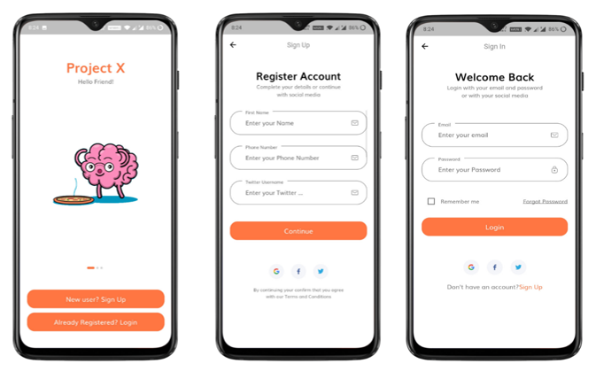
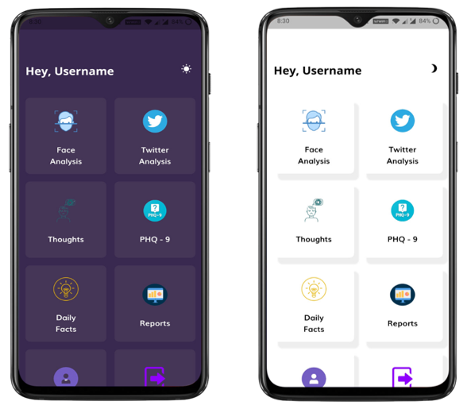
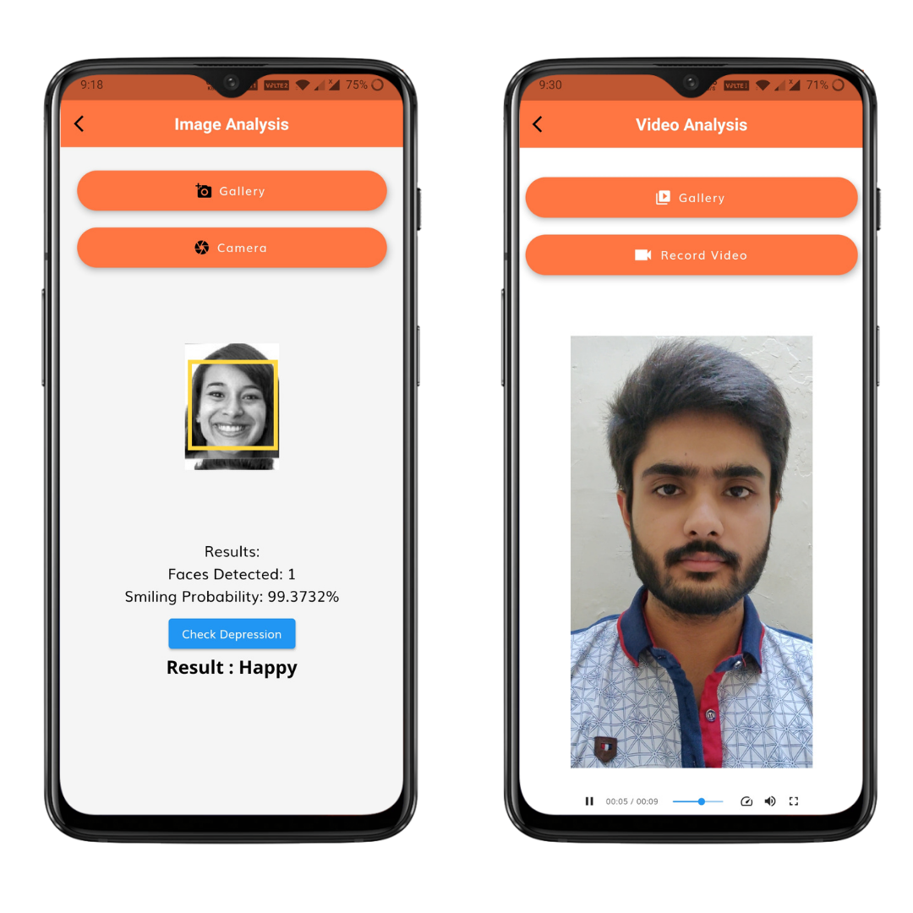
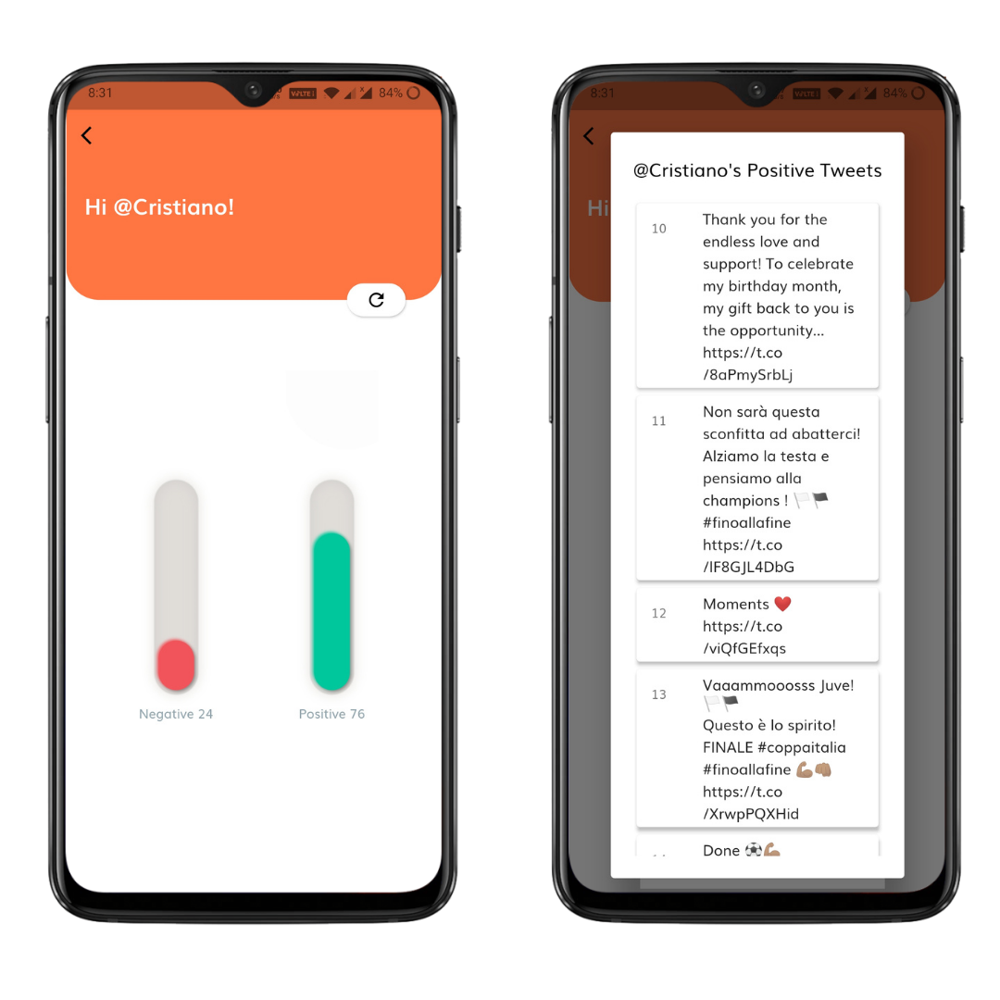
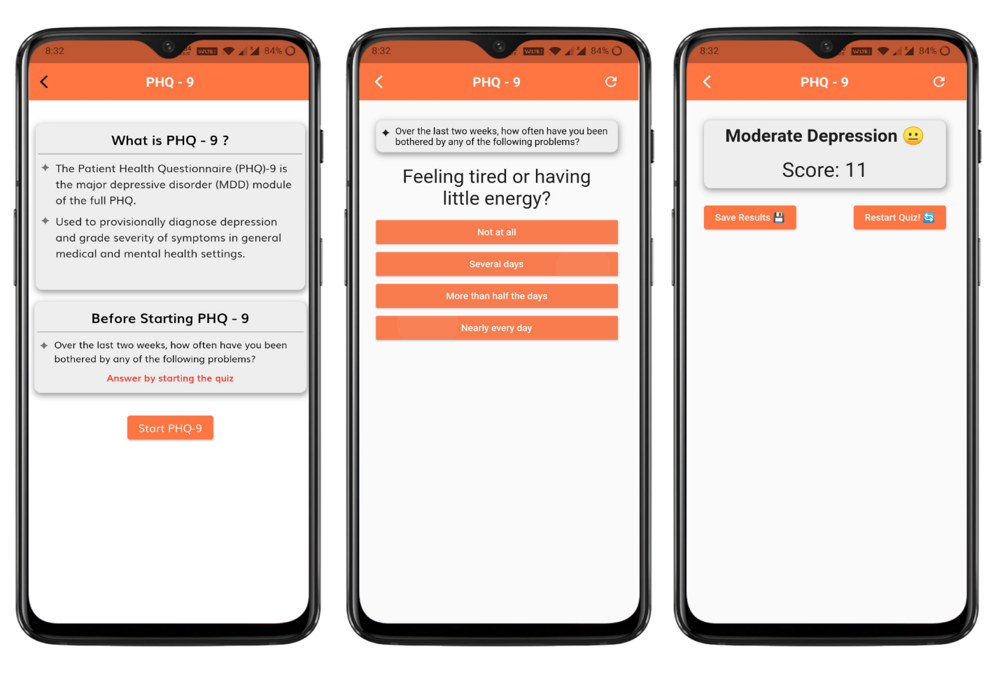
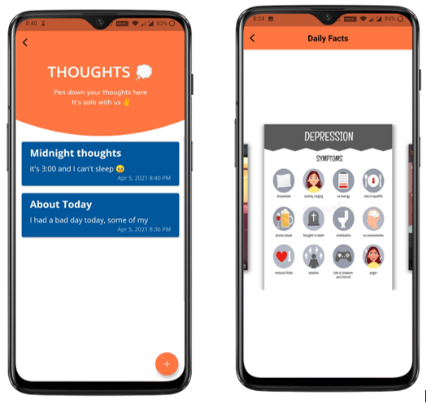

# Depression Detection - App -Flutter

One of the leading causes of illness and disability among adolescents is depression. Often, a person going through mental health issues hesitate to consult a counselor. So, the purpose of our project is to create an app that will analyze a person’s facial features and also analyze their social media activities which will be used for predicting if that person is depressed or non-depressed and if depressed then what is the level of depression in that person.

## Login & SignUp

## Home Screen (Dark + Light Mode)

## Face Analysis

## Twitter Analysis

## PHQ-9 Questions

## Thoughts & Daily Facts 

## Link for the APK
https://drive.google.com/file/d/1xVCBkhb7FEprmdePxycMR9iazBLTD91D/view?usp=drivesdk

## Video Analysis will not work as the server is not running.
